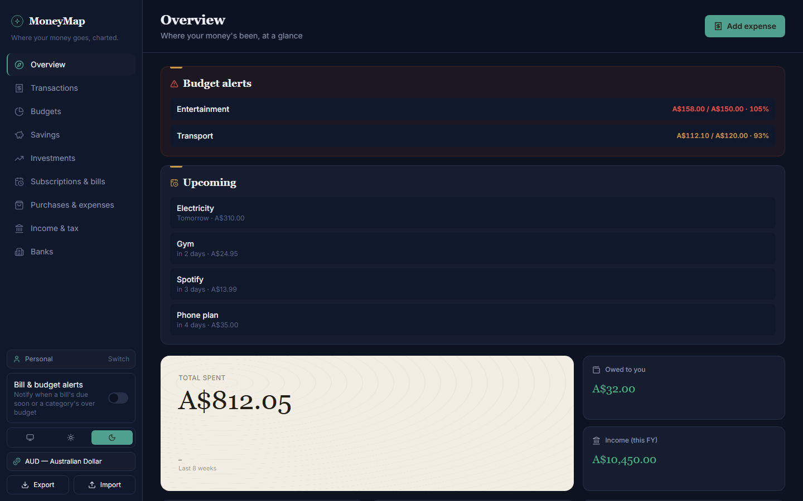
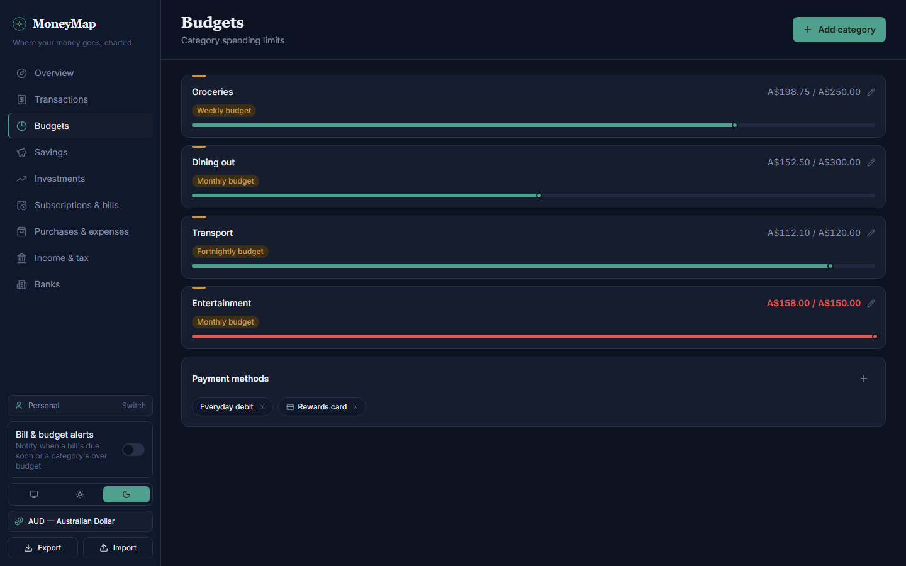
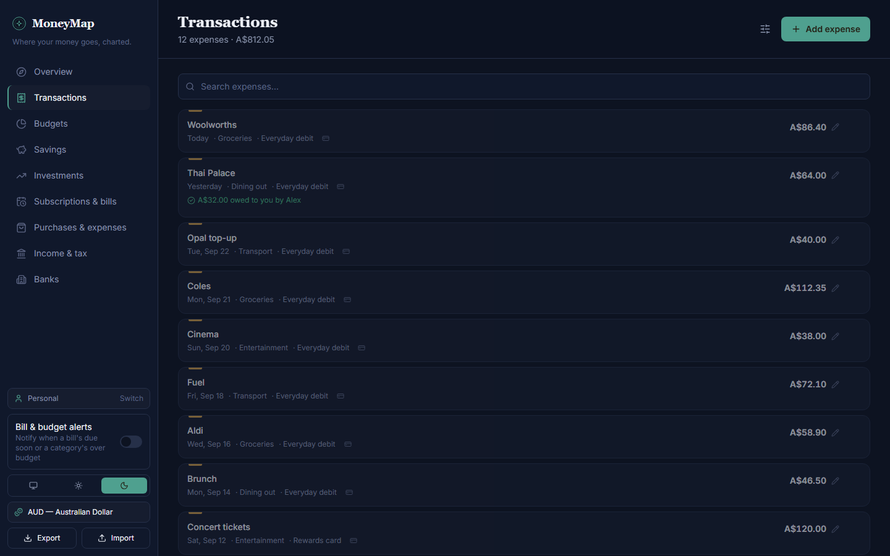
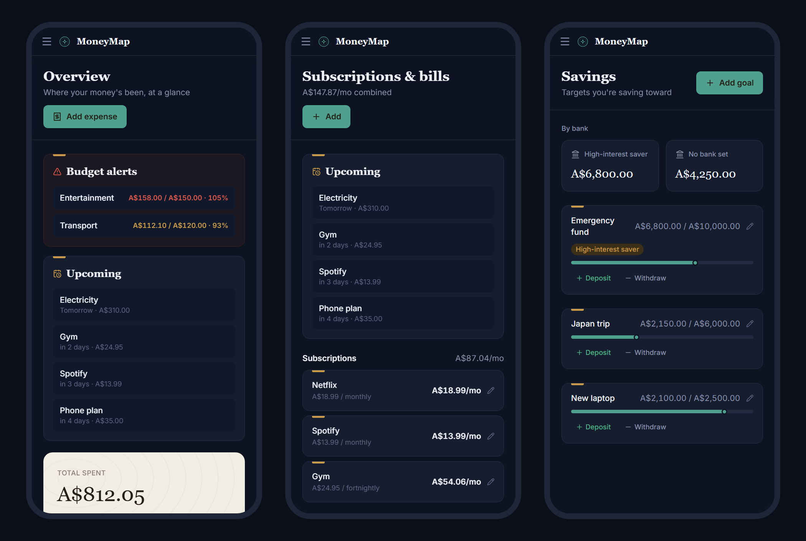
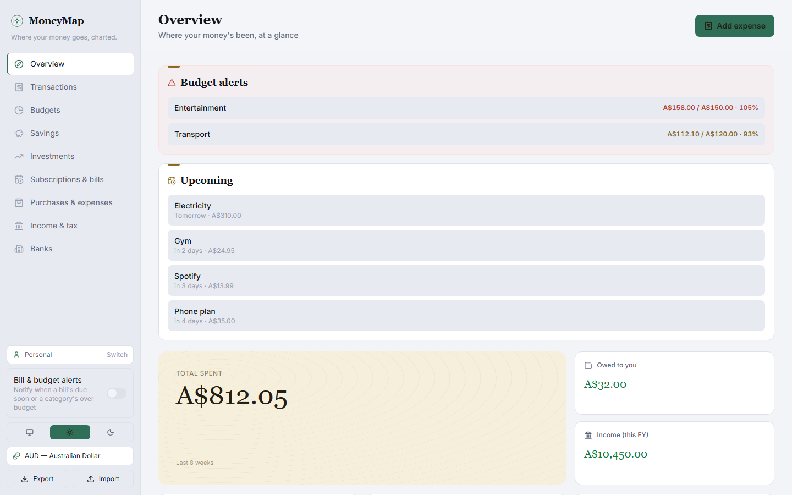

<div align="center">


# MoneyMap

**Where your money goes, charted.**

A personal finance tracker for the web and Android: one codebase, synced
through the cloud, usable offline, with private and shared ledgers for couples.


</div>

<p align="center">
  
</p>

## Features

- **Overview**: total spend, budget alerts, upcoming bills, what you're owed, and this financial year's income at a glance.
- **Transactions**: search and filter expenses by category, payment method or date; track split bills and who still owes you.
- **Budgets**: weekly, fortnightly or monthly limits per category, with progress bars that turn red when you go over.
- **Savings goals**: targets with deposits and withdrawals, grouped by bank account.
- **Investments**: holdings with purchase price vs. current value and gain/loss.
- **Subscriptions & bills**: recurring costs normalised to a monthly figure, an "upcoming" list, and one-tap "log payment".
- **Purchases & car expenses**: big-ticket items kept separate from everyday spending.
- **Income & tax**: gross/net/tax/super per payment, financial-year totals, and a **PDF export** for tax time.
- **Banks**: a spreadsheet-style pay-split table with your own custom columns.
- **Notifications**: optional alerts when a bill is due soon or a category nears its budget.
- **Private + shared ledgers**: every account gets a Personal ledger; share a separate ledger with your partner.
- **Offline-first**: opens with your last-synced data and pushes changes when you're back online.
- **Backups**: export and import everything as a single JSON file.
- **Light & dark themes**, and 10 currencies.

## Screenshots

<table>
  <tr>
    <td width="50%"></td>
    <td width="50%"></td>
  </tr>
  <tr>
    <td align="center"><sub>Budgets</sub></td>
    <td align="center"><sub>Transactions</sub></td>
  </tr>
</table>

<p align="center">
  
  <br /><sub>On a phone: overview, subscriptions & bills, savings</sub>
</p>

<p align="center">
  
  <br /><sub>Light theme</sub>
</p>

<sub>Screenshots use made-up demo data.</sub>

## How it works

```
┌──────────────────────┐        ┌──────────────────────────────┐
│  Web (static host)   │        │  Supabase                    │
│  Android (Capacitor) │ ─────▶ │  • Auth (email + password)   │
│  same React build    │ ◀───── │  • Postgres + row-level sec. │
└──────────────────────┘  HTTPS └──────────────────────────────┘
   local cache for offline
```

- **One codebase.** The React app is built once by Vite. The web version is those static files; the Android app is the same files wrapped by [Capacitor](https://capacitorjs.com).
- **No server of your own.** [Supabase](https://supabase.com) provides login and the database. The whole backend is one SQL file, [`supabase/schema.sql`](supabase/schema.sql).
- **Ledgers.** Each ledger is one JSON document. Row-level security means only a ledger's members can read it, and every write goes through a `save_ledger_state` function that merges changes instead of overwriting blindly.
- **Sync.** Changes are saved optimistically and pushed right away. Other devices pick them up within about 15 seconds, or immediately when the app regains focus.
- **Native where it matters.** On Android, notifications use `@capacitor/local-notifications`, and exports (backup JSON, tax PDF) open the system share sheet.

## Getting started

### Prerequisites

- Node.js 20+
- A free [Supabase](https://supabase.com) project
- For Android: Android Studio, or the Android SDK plus JDK 21

### 1. Set up Supabase

1. Create a project at [supabase.com](https://supabase.com).
2. Open **SQL Editor**, then paste and run [`supabase/schema.sql`](supabase/schema.sql).
3. Go to **Authentication → URL Configuration** and set **Site URL** to where the web app will live (email-confirmation links land there). Or, for a private two-person setup, turn off **Confirm email** under **Authentication → Providers → Email**.

### 2. Configure the app

```bash
cp .env.example .env.local
```

Fill in the values from **Project Settings → API Keys** (the publishable/anon key) and **Data API** (the project URL):

```env
VITE_SUPABASE_URL=https://your-project-ref.supabase.co
VITE_SUPABASE_ANON_KEY=sb_publishable_...
```

These are baked in at build time. The anon key is designed to be public; row-level security is what protects the data. **Never** use the `service_role`/secret key here.

### 3. Run it

```bash
npm install
npm run dev        # http://localhost:5173
```

## Building

### Web

```bash
npm run build      # type-checks, then outputs static files to dist/
```

Deploy `dist/` to any static host: Netlify, Cloudflare Pages, Vercel, GitHub Pages, etc. [`public/_redirects`](public/_redirects) gives Netlify and Cloudflare Pages the SPA fallback, so refreshing on `/transactions` works.

### Android

| Command | What it does |
| --- | --- |
| `npm run android:sync` | Build the web app and copy it into `android/` |
| `npm run android:open` | Open the project in Android Studio (run on a device/emulator) |
| `npm run android:apk` | Debug APK → `android/app/build/outputs/apk/debug/app-debug.apk` |
| `npm run android:release` | Signed release APK → `android/app/build/outputs/apk/release/app-release.apk` |

Re-run `android:sync` (or either APK command) after any web change.

#### Signing a release APK

Release builds are signed using `android/keystore.properties`, which is **gitignored**, as are all `*.jks`/`*.keystore` files. To set up signing on a new machine:

```bash
keytool -genkeypair -v -keystore android/moneymap-release.jks -storetype PKCS12 \
  -alias moneymap -keyalg RSA -keysize 4096 -validity 10000
```

Then create `android/keystore.properties`:

```properties
storeFile=../moneymap-release.jks
storePassword=your-store-password
keyAlias=moneymap
keyPassword=your-key-password
```

Without this file, `android:release` still builds, but produces an unsigned APK.

> **Back up the keystore and its password somewhere safe.** Android only accepts updates signed with the same key; if you lose it, you can't update the installed app and users must uninstall and reinstall.

### App icons

`node scripts/generate-icons.mjs` renders the logo into the PWA icons and the Android launcher icons and splash screens. It has no dependencies.

## Project structure

```
src/
  components/      Shared UI: layout shell, sidebar, auth/profile/connection gates, form fields
  features/<name>/ One folder per section: page, cards and forms
  lib/             Domain types and pure logic (budgets, due dates, financial year, currency),
                   plus the Supabase client (api.ts, supabase.ts) and native bridges
                   (notify.ts, saveFile.ts)
  store/           Zustand stores: finance data + sync, auth, ledgers, theme, notifications
supabase/
  schema.sql       The entire backend: tables, row-level security, RPC functions
android/           Capacitor Android project
scripts/           Icon generator
public/            PWA manifest, service worker, icons
```

## Tech stack

React 19 · TypeScript · Vite · Tailwind CSS v4 · Zustand · Framer Motion · Recharts · lucide-react · jsPDF · Supabase · Capacitor 8

## Design

A dark "chart room" palette (deep ink, verdigris accents, one warm parchment hero panel) with a wayfinding motif: a marker travels along budget and savings progress bars, because this is, literally, a map of where your money goes. The token system lives in [`src/index.css`](src/index.css).

## Support

If MoneyMap is useful to you, you can support its development on Ko-fi:
[ko-fi.com/crystaxit](https://ko-fi.com/crystaxit).

## License

[MIT](LICENSE) © 2026 Sarvesh Pandit
